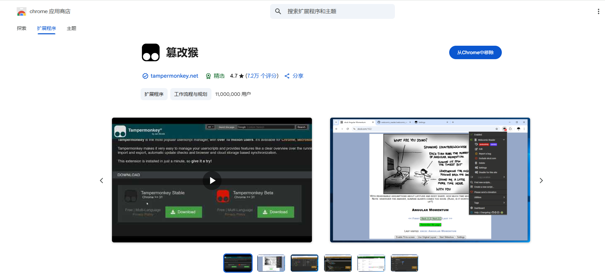
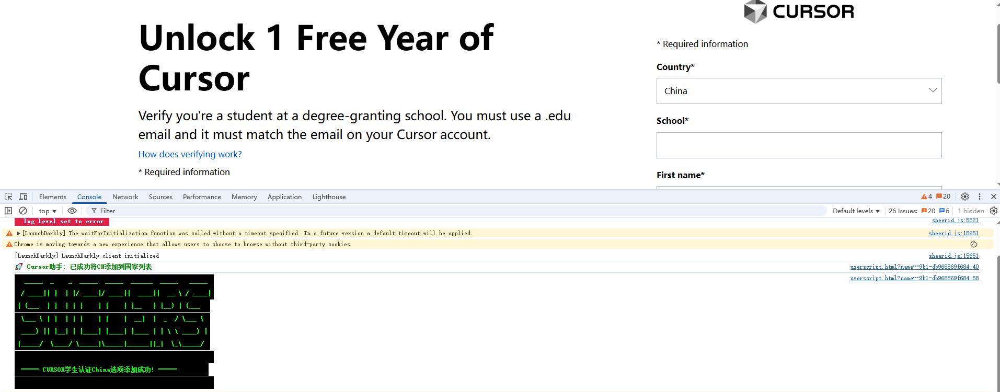
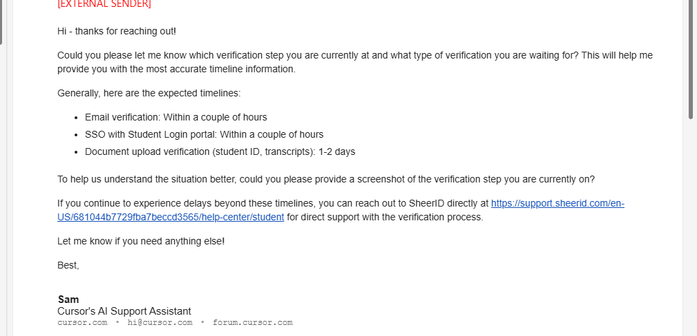

# 此方法不行了，请正规渠道购买会员或找留学朋友拿教育邮箱哈

# 🎓 本教程仅供交流学习使用，请勿用作商业用途 ⚠️⚠️⚠️⚠️⚠️⚠️

## 📧 请使用教育邮箱 .edu（其他邮箱已失效）

🔗 **官方地址**

👉 [传送门](https://www.cursor.com/students)

---

## 一、恢复选择 China 区域 🌍

### 谷歌插件安装 🛠️

1. **下载浏览器插件**：篡改猴(油猴) 🐒，[Chrome 应用商店](https://chromewebstore.google.com/category/extensions)，搜索篡改猴

或者 👉 [篡改猴](https://chromewebstore.google.com/detail/%E7%AF%A1%E6%94%B9%E7%8C%B4/dhdgffkkebhmkfjojejmpbldmpobfkfo?hl=zh-CN&utm_source=ext_sidebar)




2. **点击「添加新脚本」** ✍️ → 将`cursor_script.js`的代码复制进去

   

3. **完成后如下** ✅

   

   可以看到控制台的打印就说明脚本注入成功

   

---

## 二、制作学生资料 🎨（仅供学习交流！请勿用于其他商业或正式情景）

### **GPT-4o 生成** 🤖

1. **下载模板图片** 📄，不想用这种的，可以去百度搜索你想要的

   

2. **使用提示词生成新图片**：💬

   ```
   将图片中的姓名改为:李四，性别:男，头像改为真实的人像正面免冠照，并且所有内容都用英文
   ```

   生成后如下

   

## 三、填写资料 📝

3.1 [访问:](https://www.cursor.com/students) 🔍


注意：此处如果没有登录，需要注册登录 Cursor 账号（请使用教育邮箱！！！）📚

国家请选择 China 🇨🇳


现在点击 `Verify My Student Status` 后会往你的邮箱发送一封邮件 ✉️


你需要点击 `Finish Verifying` ✅


到下面这一步基本就是完成了，只需要等邮件就可以 🎉


# 长时间收不到 Cursor confirm 邮件的，可以试下下面的方法 ⏱️

发一份邮件给 Cursor 团队，收件人：`hi@cursor.com` 📩 ,内容如下

```
Dear Cursor Team,
I hope you are well after receiving this email. I am writing to inquire about the status of my application for an education discount that I submitted about a few hours ago. Although I have successfully uploaded the required documents, I have not received a confirmation email for submitting my application.
Please note that this email address (填你的邮箱，必须要 .edu邮箱，你的Cursor登录账号邮箱必须跟申请的邮箱一致) is the same email address used when applying. As a student actively participating in academic projects and open source contributions, receiving Cursor's education discount is essential for my studies and continued support of the developer community. I kindly ask that you assist me in expediting the application review process.
Thank you for your time and consideration. I would appreciate any updates.
Regards.

```

以上邮件 Cursor 官方的回复如下：



反正就是耐心等吧 ⌛
