# 🎓 本教程仅交流使用，请勿用作商业用途 ⚠️

## 📧 请使用教育邮箱 .edu（其他邮箱已失效）

🔗 **免费领取 Cursor 年度会员地址**（结合下方教程使用）  
👉 [https://www.cursor.com/students](https://www.cursor.com/students)

---

## 一、恢复选择 China 区域 🌍

### 方法一：通过安装插件 🛠️

1. **下载浏览器插件**：油猴脚本(篡改猴)，官网搜索[谷歌插件商店](https://chromewebstore.google.com/category/extensions)，搜索篡改猴

   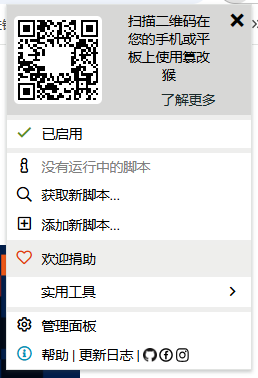

2. **点击「添加新脚本」** → 将`cursor_cn_script.js`的代码复制进去

   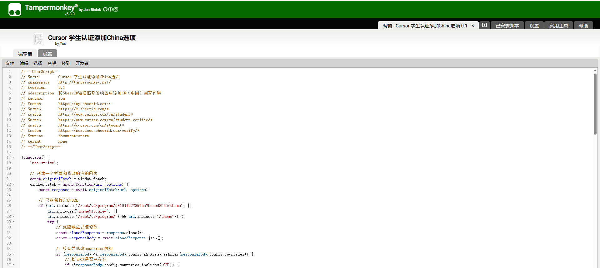

3. **完成后如下** ✅

   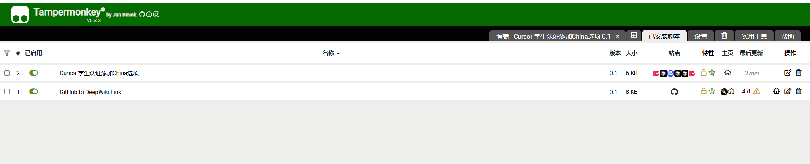

---

## 二、制作学生资料 🎨（仅供学习交流！）

### **GPT-4o 生成** 🤖

1. **下载模板图片**

   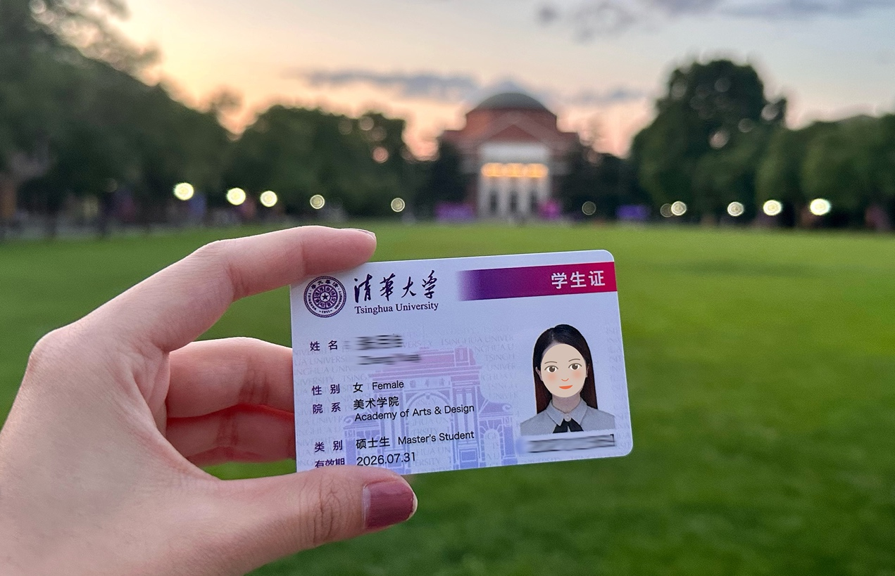

2. **使用提示词生成新图片**：

   ```
   将图片中的姓名改为:李四，性别:男，头像改为真实的人像正面免冠照，并且所有内容都用英文
   ```

   生成后如下
   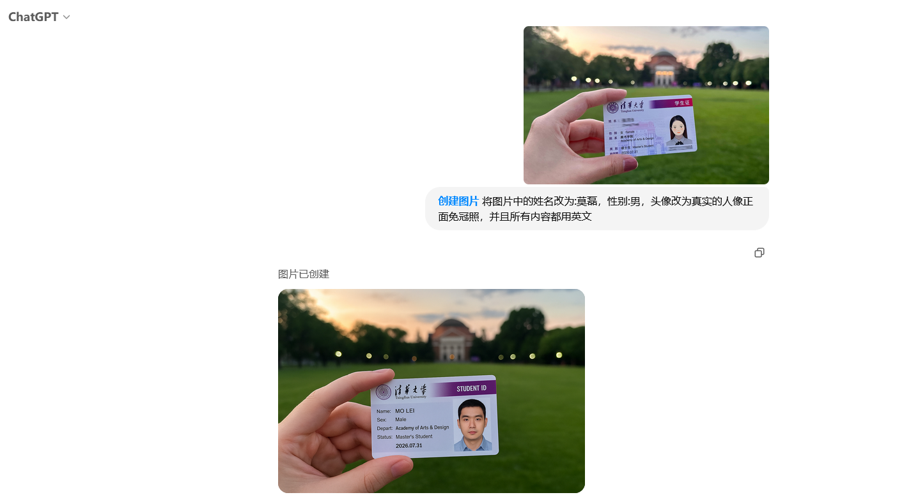

## 三、填写资料领取 Cursor 年度会员

3.1 访问 Cursor 年度会员领取地址（即学生认证可免费领取）： https://www.cursor.com/students
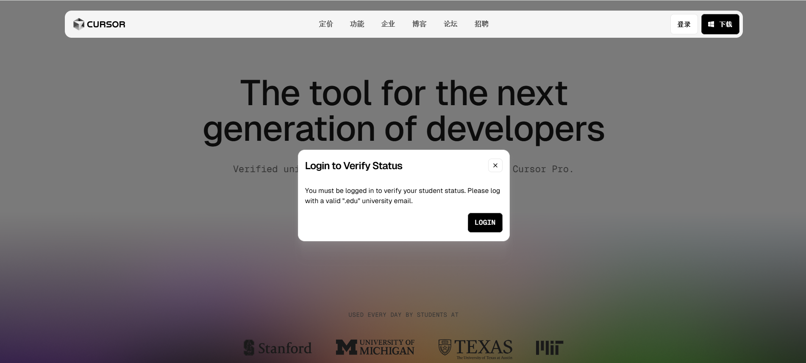

注意：此处如果没有登录，需要注册登录 Cursor 账号（请使用教育邮箱！！！）

（由于第一阶段完成了 China 地区解锁，所以，这里的 Country 应该可以选择到 China 了）

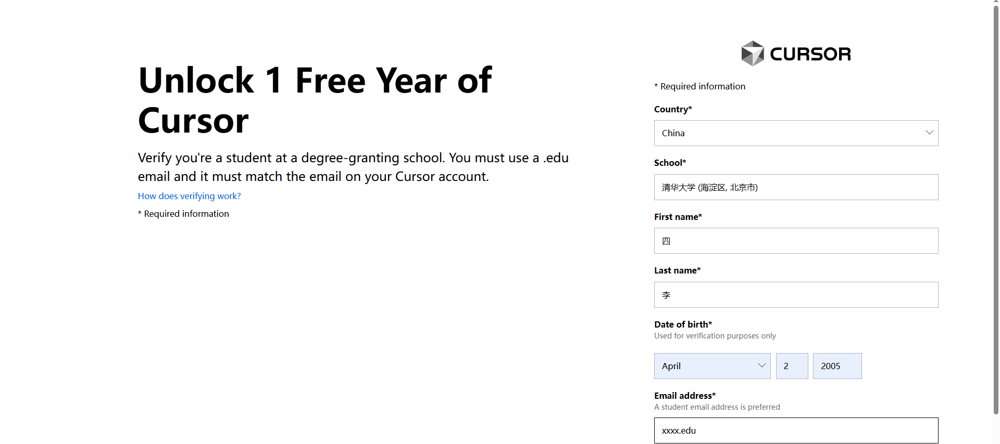

现在点击 `Verify My Student Status` 后会往你的邮箱发送一封邮件

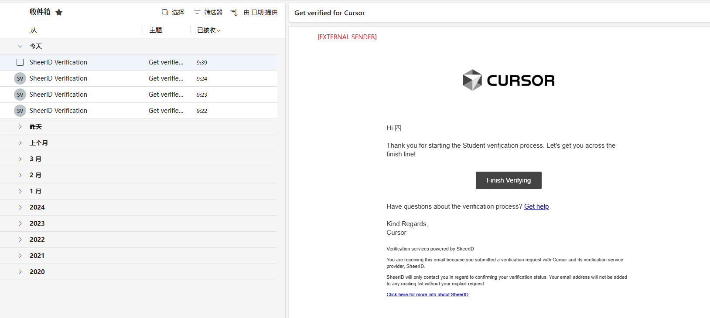

你需要点击 `Finish Verifying`

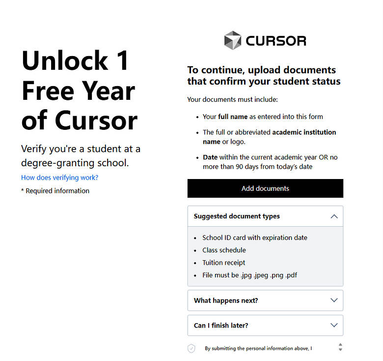

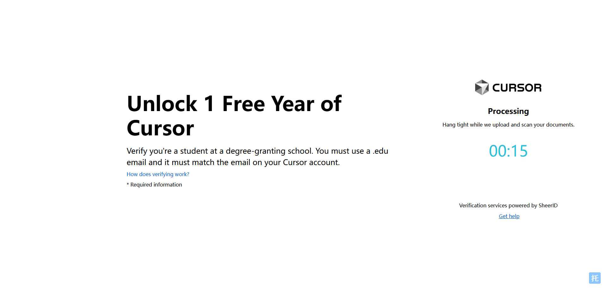

到下面这一步基本就是完成了，只需要等邮件就可以

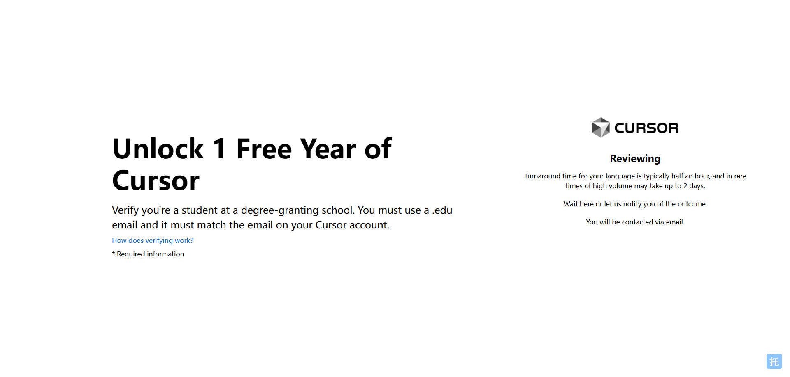
